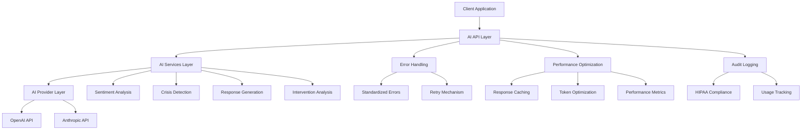

# AI System Architecture

This document provides a comprehensive overview of the AI system architecture, including its components, interactions, and design decisions.

## Overview

The AI system is designed to provide a secure, HIPAA-compliant, and extensible framework for integrating AI capabilities into the application. It supports multiple AI providers, specialized services for common AI tasks, and comprehensive error handling and performance optimization.

## Architecture Diagram



## Component Descriptions

### AI API Layer

The AI API layer provides RESTful endpoints for accessing AI capabilities. It handles request validation, authentication, and response formatting.

Key components:
- API routes for chat completion, sentiment analysis, crisis detection, etc.
- Request validation using Zod schemas
- Authentication and authorization checks
- Rate limiting
- Response formatting

### AI Services Layer

The AI Services layer provides specialized services for common AI tasks. It abstracts away the details of prompt engineering and response parsing.

Key components:
- `SentimentAnalysisService`: Analyzes the sentiment of text
- `CrisisDetectionService`: Detects potential crisis situations in text
- `ResponseGenerationService`: Generates therapeutic responses
- `InterventionAnalysisService`: Analyzes the effectiveness of therapeutic interventions

### AI Provider Layer

The AI Provider layer provides a unified interface for interacting with different AI providers. It handles provider-specific details like API formats, authentication, and error handling.

Key components:
- `OpenAIProvider`: Interacts with the OpenAI API
- `AnthropicProvider`: Interacts with the Anthropic API
- Provider factory for creating provider instances

### Error Handling

The Error Handling system provides standardized error handling across the AI system. It transforms provider-specific errors into standardized errors and provides retry mechanisms for transient errors.

Key components:
- `AIError` class for standardized errors
- Error transformation utilities
- Retry mechanism with exponential backoff
- API error response handling

### Performance Optimization

The Performance Optimization system improves the performance and reliability of AI services. It includes caching, token optimization, and performance metrics.

Key components:
- Response caching with LRU eviction
- Token usage estimation and optimization
- Performance metrics collection
- Latency and token usage warnings

### Audit Logging

The Audit Logging system provides comprehensive logging for AI operations. It logs all AI requests, responses, errors, and performance metrics.

Key components:
- HIPAA-compliant audit logging
- Usage tracking
- Error logging
- Performance metrics logging

## Data Flow

### Chat Completion Flow

1. Client sends a request to the `/api/ai/completion` endpoint
2. API layer validates the request and authenticates the user
3. API layer creates an AI service instance using the factory
4. AI service sends the request to the appropriate provider
5. Provider sends the request to the AI API (OpenAI, Anthropic, etc.)
6. Provider receives the response and transforms it into a standardized format
7. AI service returns the response to the API layer
8. API layer formats the response and sends it to the client

### Error Handling Flow

1. AI provider encounters an error (e.g., rate limit exceeded)
2. Provider layer catches the error and transforms it into a standardized AIError
3. If the error is transient, the retry mechanism attempts to retry the request
4. If the retry fails or the error is not transient, the error is propagated to the API layer
5. API layer formats the error response and sends it to the client
6. Error is logged in the audit log

### Performance Optimization Flow

1. AI service receives a request
2. Performance optimization layer checks the cache for a matching request
3. If a cache hit occurs, the cached response is returned immediately
4. If a cache miss occurs, the request is sent to the provider
5. Provider sends the request to the AI API
6. Response is received and cached for future requests
7. Performance metrics are collected and logged
8. Response is returned to the client

## Design Decisions

### Provider Abstraction

The system uses a provider abstraction layer to support multiple AI providers. This allows for:
- Easy switching between providers
- Fallback to alternative providers if one is unavailable
- Comparison of results from different providers
- Future addition of new providers

### Service Specialization

The system uses specialized services for common AI tasks. This allows for:
- Optimized prompts for specific tasks
- Consistent response formats
- Reuse of common functionality
- Easier testing and validation

### Error Standardization

The system standardizes errors across providers. This allows for:
- Consistent error handling
- Improved error messages for users
- Easier debugging and monitoring
- Retry mechanisms for transient errors

### Performance Optimization

The system includes performance optimization features. This allows for:
- Reduced latency through caching
- Lower costs through token optimization
- Better monitoring through performance metrics
- Improved reliability through retry mechanisms

### HIPAA Compliance

The system is designed to be HIPAA compliant. This includes:
- Comprehensive audit logging
- Secure handling of sensitive data
- Access controls and authentication
- Encryption of data in transit and at rest

## Implementation Details

### Directory Structure

```
src/lib/ai/
├── index.ts                # Main exports
├── factory.ts              # AI service factory
├── error-handling.ts       # Error handling utilities
├── performance.ts          # Performance optimization utilities
├── analytics.ts            # Usage analytics
├── providers/
│   ├── index.ts            # Provider exports
│   ├── openai.ts           # OpenAI provider
│   └── anthropic.ts        # Anthropic provider
├── services/
│   ├── index.ts            # Service exports
│   ├── sentiment.ts        # Sentiment analysis service
│   ├── crisis.ts           # Crisis detection service
│   ├── response.ts         # Response generation service
│   └── intervention.ts     # Intervention analysis service
└── models/
    ├── index.ts            # Model exports
    ├── messages.ts         # Message types
    ├── completion.ts       # Completion types
    └── errors.ts           # Error types
```

### Key Interfaces

#### AI Service

```typescript
interface AIService {
  createChatCompletion(
    messages: AIMessage[],
    options?: AIServiceOptions
  ): Promise<AICompletion>;
  
  createStreamingChatCompletion(
    messages: AIMessage[],
    options?: AIServiceOptions
  ): Promise<AIStreamingCompletion>;
  
  getModelInfo(model: string): ModelInfo;
}
```

#### AI Provider

```typescript
interface AIProvider {
  createChatCompletion(
    messages: AIMessage[],
    options?: AIServiceOptions
  ): Promise<AICompletion>;
  
  createStreamingChatCompletion(
    messages: AIMessage[],
    options?: AIServiceOptions
  ): Promise<AIStreamingCompletion>;
  
  getModelInfo(model: string): ModelInfo;
  
  getSupportedModels(): string[];
}
```

#### AI Error

```typescript
interface AIErrorOptions {
  code: AIErrorCode;
  statusCode?: number;
  context?: Record<string, any>;
  cause?: Error;
}

class AIError extends Error {
  code: AIErrorCode;
  statusCode: number;
  context?: Record<string, any>;
  cause?: Error;
  
  constructor(message: string, options: AIErrorOptions);
}
```

## Security Considerations

### Data Privacy

- All AI requests and responses are encrypted in transit using TLS
- Sensitive data is not stored in logs or caches
- User data is anonymized where possible
- Data retention policies are enforced

### Authentication and Authorization

- All AI endpoints require authentication
- Role-based access control restricts access to AI features
- API keys for AI providers are stored securely
- Audit logging tracks all access to AI features

### Rate Limiting

- Rate limits prevent abuse of AI endpoints
- Separate rate limits for different AI features
- Gradual backoff for repeated requests
- Alerts for suspicious activity

### Content Filtering

- AI responses are filtered for harmful content
- Crisis detection identifies potential harm
- Moderation systems review high-risk interactions
- Escalation procedures for serious concerns

## Performance Considerations

### Caching

- Response caching reduces latency and costs
- Cache invalidation strategies prevent stale data
- Cache size limits prevent memory issues
- Cache hit/miss metrics track effectiveness

### Token Optimization

- Message truncation reduces token usage
- Token estimation prevents exceeding limits
- Token usage tracking identifies optimization opportunities
- Cost allocation tracks usage by feature

### Latency Management

- Timeout handling prevents hanging requests
- Performance metrics identify slow requests
- Retry mechanisms handle transient errors
- Fallback providers ensure availability

## Monitoring and Analytics

### Usage Tracking

- Request counts by endpoint, provider, and model
- Token usage by provider and model
- Response times by endpoint, provider, and model
- Error rates by endpoint, provider, and model

### Performance Metrics

- Average response time
- 95th percentile response time
- Cache hit rate
- Token usage efficiency

### Error Tracking

- Error counts by type and provider
- Retry success rate
- Rate limit hits
- Content filter triggers

### Health Checks

- Provider availability monitoring
- API endpoint health checks
- Performance degradation alerts
- Error rate thresholds

## Future Enhancements

### Additional Providers

- Google AI/Gemini integration
- Azure OpenAI integration
- DeepSeek integration
- Local LLM support

### Advanced Features

- Fine-tuning support
- Embeddings for semantic search
- Batch processing for analytics
- Model evaluation and comparison

### Performance Improvements

- Distributed caching
- Predictive prefetching
- Adaptive token optimization
- Load balancing across providers

### Security Enhancements

- Enhanced content filtering
- Improved anonymization
- Federated learning
- Differential privacy 